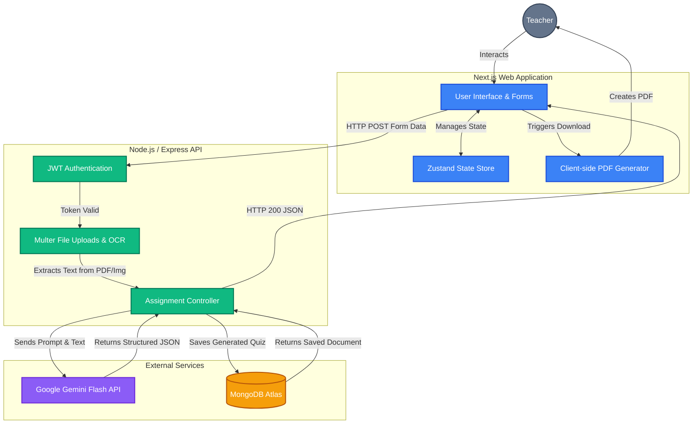

# VedaAI Architecture & Approach

This document outlines the high-level architecture and technical approach used in the VedaAI Assessment Creator platform.

## 🏗 System Architecture

The platform follows a modern, decoupled Client-Server architecture:
1. **Client (Frontend)**: A Next.js (App Router) application responsible for the user interface, routing, and state management.
2. **Server (Backend)**: A Node.js/Express REST API responsible for business logic, authentication, AI orchestration, and file processing.
3. **Database**: MongoDB for persistent data storage.

### Architecture Flow

## 🛠 Approach & Technologies Used

### 1. Frontend Approach
- **Framework**: Next.js App Router for optimized routing and SEO.
- **Styling**: Tailwind CSS for rapid, responsive UI development. Custom gradients and micro-animations provide a premium feel.
- **State Management**: Zustand for lightweight, un-opinionated global state (used heavily for Authentication state across the app).
- **Icons & Graphics**: SVGs and Lucide-React icons for crisp, scalable vectors.

### 2. Backend Approach
- **Runtime & Framework**: Node.js with Express.
- **Language**: TypeScript for strict typing and fewer runtime errors.
- **Security**: JWT (JSON Web Tokens) for stateless authentication. Passwords are encrypted using bcrypt.

### 3. File Processing & AI Pipeline
- **File Uploads**: Handled via `multer`. We process the file into a buffer without persisting heavily on the disk.
- **Optical Character Recognition (OCR)**: For images (PNG/JPG), the backend uses `tesseract.js` to extract text.
- **PDF Extraction**: `pdf-parse` is used to scrape text content from uploaded PDFs.
- **Generative AI**: The extracted text is bundled into an engineered prompt and sent to **Google's Gemini API**. The prompt strictly instructs Gemini to return a raw JSON structure matching our database schema.

### 4. Database Schema
- **MongoDB** is used via Mongoose. The schema is highly flexible, storing an array of mixed question types (`MCQ`, `Short Answer`, `Fill in the Blanks`, `True/False`) directly inside the `Assignment` document.

## 🚀 Why this Approach?
- **Speed & Scale**: The decoupling of frontend and backend allows them to scale independently on platforms like Vercel and Render.
- **Cost Efficiency**: Using free-tier compatible tools (Vercel, Render, MongoDB Atlas, Gemini Free Tier) keeps the project easily maintainable for individuals and small teams.
- **Reliable AI Parsing**: By explicitly asking Gemini for JSON instead of plain text, the frontend can seamlessly map the data to beautiful UI components (like multiple-choice radio buttons) rather than rendering a block of text.
